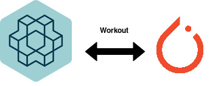

# Workout

### What is Workout?

Workout is an API to import and use `OpenAI-Gym`'s environment with `PyTorch` effortlessly

## Why it is required?

`PyTorch`: Flexible framework to implement deep neural networks and has better GPU integration
`OpenAI-Gym`: Provides extensive and varied Reinforcement Learning environments to use readily

However, the integration between two is not very extensive. Many works have been done to implement 
deep network based Reinforcement Learning algorithms using `PyTorch` seperately, then transfer the whole control
to `Gym`'s environment to estimate reward function, state of the system, possible actions for next step, etc.,
and pass it again to PyTorch's model. Therefore, to avoid such complications, `Workout` imports the `Gym`'s
environment, translates it to more `PyTorch` oriented and embed it to the `PyTorch`'s model. By this way,
the users shall effortlessly use `Gym`'s environment without affecting `PyTorch`'s syntactic sugar. Also, the
translation to `PyTorch` codebase would improve the uniformity of the underlying kernel and helps heavily in
parallelization with GPUs.
